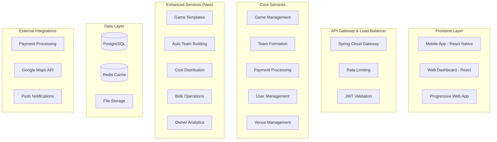

# Pickup Sports App - Plei-Like Architecture Specification

## Executive Summary

This specification outlines the architecture for a Plei/Good Rec-inspired pickup sports application that enables:
- **App owners** to book fields and create games  
- **Players** to discover, register, and play in organized sports games
- **Dynamic team formation** with various formats (5v5, 7v7, etc.)
- **Payment splitting** and automated financial management
- **Mobile-first** user experience with real-time updates

## System Architecture Overview

### Current Foundation ✅
Your existing codebase provides a solid foundation with:
- Spring Boot microservices architecture
- JWT-based authentication with role management
- Comprehensive Game and Venue entities
- Payment processing infrastructure
- Real-time chat and notifications
- AI recommendation engine
- Multi-tenant support
- Geographic proximity search

### Enhanced Architecture (Plei-Like Features)



## Core Data Model

### 1. GameTemplate Entity (NEW)
**Purpose**: Define reusable game formats like "5v5 Soccer", "7v7 Football"

```java
@Entity
@Table(name = "game_templates")
public class GameTemplate {
    private Long id;
    
    // Template Definition
    private String name;          // "5v5 Soccer"
    private String sport;         // "Soccer"
    private String format;        // "5v5"
    private String description;
    
    // Team Structure
    private Integer playersPerTeam;    // 5
    private Integer totalTeams;        // 2
    private Integer minPlayers;        // 8 (minimum to start)
    private Integer maxPlayers;        // 12 (including subs)
    private Integer substituteSlots;   // 2
    
    // Game Configuration
    private Integer durationMinutes;   // 90
    private String defaultRules;
    private String requiredEquipment;
    private String positions;          // JSON: ["GK","DEF","MID","FWD"]
    
    // Business Rules
    private Boolean skillBalancingRequired;
    private Boolean captainAssignmentRequired;
    private Boolean positionAssignmentRequired;
    
    // Popularity Tracking
    private Integer popularity;        // Usage count
    private Boolean isActive;
}
```

### 2. Team Entity (NEW)
**Purpose**: Represent teams formed within games

```java
@Entity
@Table(name = "teams")
public class Team {
    private Long id;
    private Game game;
    
    // Team Identity
    private String teamName;         // "Red Team", "Team A"
    private String teamColor;        // "#FF0000"
    private Integer teamNumber;      // 1, 2, 3, 4
    
    // Leadership
    private User captain;
    private User coCaptain;
    
    // Team Stats
    private Double averageSkillLevel;
    private Integer totalExperience;
    private Integer activePlayersCount;
    private Integer substitutePlayersCount;
    
    // Formation Info
    private Boolean isBalanced;
    private FormationStrategy formationStrategy;
    private OffsetDateTime formedAt;
    private TeamStatus status;
}
```

### 3. TeamMember Entity (NEW) 
**Purpose**: Link users to teams with payment and position tracking

```java
@Entity
@Table(name = "team_members")
public class TeamMember {
    private Long id;
    private Team team;
    private User user;
    
    // Role & Position
    private MemberType memberType;     // ACTIVE, SUBSTITUTE, CAPTAIN
    private String preferredPosition;  // "GK", "DEF", "MID", "FWD"
    private String assignedPosition;
    private boolean isSubstitute;
    private Integer jerseyNumber;
    
    // Payment Tracking
    private BigDecimal amountOwed;
    private BigDecimal amountPaid;
    private String paymentIntentId;
    private PaymentStatus paymentStatus;
    
    // Game Day
    private OffsetDateTime joinedAt;
    private OffsetDateTime checkedInAt;
    private Boolean attended;
    private Integer performanceRating;  // 1-5 post-game rating
}
```

### 4. Enhanced Game Entity
**Additions to existing Game entity**:

```java
// Add to existing Game entity:
@ManyToOne
private GameTemplate gameTemplate;      // Template used for this game

@OneToMany(mappedBy = "game")
private Set<Team> teams;               // Teams formed for this game

// Enhanced fields already exist:
// - minPlayers, maxPlayers (dynamic based on template)
// - pricePerPlayer, totalCost
// - venue relationship
// - status, gameType
```

## Service Layer Architecture

### 1. GameTemplateService (NEW)
**Purpose**: Manage reusable game templates

```java
@Service
public class GameTemplateService {
    
    // Template Management
    public GameTemplate createTemplate(CreateTemplateRequest request);
    public List<GameTemplate> getTemplatesForSport(String sport);
    public GameTemplate getTemplateById(Long id);
    public GameTemplate updateTemplate(Long id, UpdateTemplateRequest request);
    
    // Template Application
    public Game createGameFromTemplate(Long templateId, Long venueId, 
                                     OffsetDateTime startTime, BigDecimal pricing);
    
    // Popular Templates
    public List<GameTemplate> getMostPopularTemplates(int limit);
    public List<GameTemplate> getTemplatesForOwner();
    
    // Template Validation
    public boolean validateTemplate(GameTemplate template);
    public boolean canTemplateAccommodate(Long templateId, int playerCount);
}
```

### 2. TeamFormationService (NEW)
**Purpose**: Automatic and manual team formation

```java
@Service  
public class TeamFormationService {
    
    // Automatic Team Formation
    public List<Team> autoFormTeams(Long gameId, FormationStrategy strategy);
    public List<Team> balanceTeamsBySkill(Long gameId);
    public List<Team> randomTeamAssignment(Long gameId);
    
    // Team Management  
    public Team assignPlayerToTeam(Long gameId, Long userId, Integer teamNumber);
    public void assignCaptains(Long gameId);
    public void shuffleTeams(Long gameId);
    public void reassignPlayer(Long teamMemberId, Integer newTeamNumber);
    
    // Team Validation
    public boolean validateTeamFormation(Long gameId);
    public boolean areTeamsBalanced(Long gameId);
    public List<String> getFormationIssues(Long gameId);
    
    // Team Statistics
    public TeamBalance calculateTeamBalance(Long gameId);
    public List<TeamStats> getTeamStatistics(Long gameId);
}
```

### 3. PaymentSplittingService (NEW)
**Purpose**: Automated payment distribution

```java
@Service
public class PaymentSplittingService {
    
    // Payment Calculation
    public PaymentBreakdown calculateGamePayments(Long gameId);
    public BigDecimal calculatePlayerShare(Long gameId, Long userId);
    public PaymentSplit calculateVenueOwnerShare(Long gameId);
    
    // Payment Processing
    public List<PaymentIntent> processTeamPayments(Long gameId);
    public void handlePlayerPayment(Long teamMemberId, String paymentIntentId);
    public void processRefunds(Long gameId, RefundReason reason);
    
    // Financial Reporting
    public OwnerPayout calculateOwnerPayout(Long ownerId, LocalDate date);
    public PaymentSummary getGamePaymentSummary(Long gameId);
    public List<Transaction> getPlayerPaymentHistory(Long userId);
}
```

## User Experience Workflows

### 1. App Owner Workflow
```
1. Owner Dashboard Login
   ↓
2. Select Venue & Time Slots
   ↓  
3. Choose Game Template (5v5 Soccer, 7v7 Football, etc.)
   ↓
4. Set Pricing & Custom Rules
   ↓
5. Publish Game (opens registration)
   ↓
6. Monitor Registrations & Team Formation
   ↓
7. Game Day Management & Check-ins
   ↓
8. Payment Settlement & Analytics
```

### 2. Player Discovery & Registration
```
1. User Opens App
   ↓
2. Location-Based Game Discovery
   - Filter by: Sport, City, Time, Skill Level, Price
   - Show: Available spots, team formation status
   ↓
3. Game Selection & Details View
   - Game info, venue details, current teams
   - Player list, chat preview
   ↓
4. One-Tap Registration & Payment
   - Secure payment processing
   - Position preferences
   ↓
5. Team Assignment Notification
   - Team details, captain info, game chat access
   ↓
6. Game Day Check-in (QR code/GPS)
   ↓
7. Post-Game Rating & Feedback
```

### 3. Dynamic Team Formation Flow
```
1. Game Created with Template
   ↓
2. Players Register (with position preferences)
   ↓
3. Auto-Balance Algorithm Triggers (when min players reached)
   - Skill-based balancing
   - Position consideration
   - Friend group preservation (optional)
   ↓
4. Captain Assignment
   - Highest skill players or manual selection
   ↓
5. Team Finalization & Notification
   - Team rosters published
   - Team chat channels created
   ↓
6. Game Day Team Management
   - Check-ins, substitutions, lineup changes
```

## API Endpoints Specification

### Game Templates API
```http
GET    /api/game-templates                    # List all templates
GET    /api/game-templates/{id}               # Get template details
GET    /api/game-templates/sport/{sport}      # Templates for specific sport
POST   /api/game-templates                    # Create new template (admin)
PUT    /api/game-templates/{id}               # Update template
DELETE /api/game-templates/{id}               # Deactivate template

# Template Application
POST   /api/game-templates/{id}/apply         # Create game from template
```

### Enhanced Game API
```http
GET    /api/games/discover                    # Enhanced discovery with city filtering
GET    /api/games/nearby                      # Location-based with team info
GET    /api/games/{id}/teams                  # Get game teams
POST   /api/games/{id}/teams/form             # Trigger team formation
PUT    /api/games/{id}/teams/rebalance        # Rebalance teams

# Bulk Operations (Owner)
POST   /api/games/bulk                        # Create multiple games
PUT    /api/games/bulk                        # Bulk update games  
DELETE /api/games/bulk                        # Cancel game series
```

### Team Management API
```http
GET    /api/teams/{id}                        # Team details
GET    /api/teams/{id}/members               # Team roster
POST   /api/teams/{id}/members               # Add player to team
DELETE /api/teams/{id}/members/{userId}      # Remove player
PUT    /api/teams/{id}/captain/{userId}      # Assign captain
POST   /api/teams/{id}/shuffle               # Shuffle team members

# Team Formation
POST   /api/games/{gameId}/teams/auto-form   # Auto-form teams
POST   /api/games/{gameId}/teams/balance     # Balance existing teams
```

### Payment & Financial API
```http
GET    /api/payments/games/{gameId}/breakdown # Payment breakdown
POST   /api/payments/games/{gameId}/process  # Process game payments
POST   /api/payments/split                   # Split payment among players
GET    /api/payments/users/{userId}/history  # Payment history

# Owner Financial
GET    /api/owners/{id}/payouts              # Owner payout summary
GET    /api/owners/{id}/analytics            # Revenue analytics
POST   /api/owners/{id}/payouts/process      # Process owner payout
```

## Implementation Phases

### Phase 1: Core Infrastructure ✅ (COMPLETED)
- [x] GameTemplate entity and repository
- [x] Team and TeamMember entities
- [x] Database migrations
- [x] Enhanced Game entity relationships
- [x] Top 10 games seed data

### Phase 2: Service Layer (CURRENT FOCUS)
- [ ] GameTemplateService implementation
- [ ] TeamFormationService with auto-balancing
- [ ] PaymentSplittingService
- [ ] Enhanced game creation with templates
- [ ] Bulk game operations for owners

### Phase 3: API & User Experience
- [ ] Enhanced game discovery APIs
- [ ] Mobile-optimized React components
- [ ] Real-time team formation updates
- [ ] Owner dashboard interface
- [ ] Player registration flow

### Phase 4: Advanced Features
- [ ] Sophisticated team balancing algorithms
- [ ] Social features (friends, invitations)
- [ ] Performance analytics
- [ ] Advanced payment options
- [ ] AI-powered recommendations

## Mobile App Features Specification

### Home Screen (Post-Login)
```
┌─────────────────────────────────┐
│ 📍 Current City: New York       │
├─────────────────────────────────┤
│ 🔥 Trending Now                 │
│ ⚽ 5v5 Soccer - Central Park    │
│ 🏀 3v3 Basketball - Brooklyn    │
│ 🏈 7v7 Football - Queens        │
├─────────────────────────────────┤
│ 🎯 Quick Join Options           │
│ [Soccer] [Basketball] [Football]│
├─────────────────────────────────┤
│ 📋 Your Games                   │
│ • Soccer @ Central Park (2hrs)  │
│ • Basketball @ Local Gym (1d)   │
└─────────────────────────────────┘
```

### Game Discovery Flow
```
Filter Options:
├── Sport Selection (Soccer, Basketball, Football, etc.)
├── City/Location (Auto-detect + Manual)
├── Time Range (Today, This Week, Custom)
├── Skill Level (Beginner, Intermediate, Advanced, Pro)
├── Price Range ($0-50+ slider)
├── Available Spots (Show only joinable games)
└── Format (5v5, 7v7, 3v3, etc.)

Game Card Display:
┌─────────────────────────────────┐
│ ⚽ 5v5 Soccer                   │
│ 📍 Central Park Field A        │ 
│ 🕐 Today 6:00 PM (2hrs)        │
│ 👥 8/12 players • 2 teams      │
│ 💰 $15/player                  │
│ 🎯 Intermediate level           │
│ [Quick Join] [View Details]     │
└─────────────────────────────────┘
```

### Team Formation Interface
```
Team Formation Screen:
┌─────────────────────────────────┐
│ ⚽ Central Park Soccer          │
│ Teams forming automatically...   │
├─────────────────────────────────┤
│ 🔴 Red Team (5/6)              │
│ 👨‍💼 Captain: Mike (⭐⭐⭐⭐)        │
│ • John (DEF) ⭐⭐⭐               │
│ • Sarah (MID) ⭐⭐⭐⭐             │
│ • Alex (FWD) ⭐⭐                │
│ • Lisa (MID) ⭐⭐⭐               │
│ ➕ Need 1 more player           │
├─────────────────────────────────┤
│ 🔵 Blue Team (4/6)             │  
│ 👨‍💼 Captain: David (⭐⭐⭐⭐⭐)       │
│ • Emma (GK) ⭐⭐⭐⭐              │
│ • Tom (DEF) ⭐⭐⭐                │
│ • Ryan (FWD) ⭐⭐⭐⭐              │
│ ➕ Need 2 more players          │
└─────────────────────────────────┘
```

## Technical Implementation Details

### 1. Game Template System
**Database Schema:**
```sql
CREATE TABLE game_templates (
    id BIGSERIAL PRIMARY KEY,
    name VARCHAR(100) NOT NULL,           -- "5v5 Soccer"
    sport VARCHAR(50) NOT NULL,           -- "Soccer"
    format VARCHAR(20) NOT NULL,          -- "5v5" 
    players_per_team INTEGER NOT NULL,    -- 5
    total_teams INTEGER DEFAULT 2,        -- 2
    min_players INTEGER NOT NULL,         -- 8
    max_players INTEGER NOT NULL,         -- 12
    substitute_slots INTEGER DEFAULT 0,   -- 2
    duration_minutes INTEGER NOT NULL,    -- 90
    skill_balancing_required BOOLEAN DEFAULT true,
    captain_assignment_required BOOLEAN DEFAULT true,
    popularity INTEGER DEFAULT 0,
    is_active BOOLEAN DEFAULT true
);
```

### 2. Team Formation Algorithm
```python
def auto_balance_teams(game_id, strategy='SKILL_BALANCED'):
    """
    Automatic team formation with skill balancing
    """
    game = get_game(game_id)
    template = game.game_template
    participants = get_game_participants(game_id)
    
    if strategy == 'SKILL_BALANCED':
        # Sort players by skill level
        sorted_players = sorted(participants, 
                              key=lambda p: p.user.skill_level, 
                              reverse=True)
        
        # Snake draft allocation
        teams = create_empty_teams(template.total_teams)
        team_index = 0
        direction = 1
        
        for player in sorted_players:
            teams[team_index].add_player(player)
            team_index += direction
            
            if team_index >= len(teams) or team_index < 0:
                direction *= -1
                team_index = max(0, min(len(teams)-1, team_index))
        
        # Assign captains (highest skill on each team)
        for team in teams:
            highest_skill = max(team.players, key=lambda p: p.skill_level)
            team.assign_captain(highest_skill)
            
    return teams
```

### 3. Payment Splitting Logic
```python
def calculate_payment_split(game_id):
    """
    Calculate how costs are split among participants
    """
    game = get_game(game_id)
    venue_cost = game.venue_booking.total_cost
    app_commission = venue_cost * 0.10  # 10% commission
    player_share = (venue_cost + app_commission) / game.participants.count()
    
    return PaymentBreakdown(
        venue_cost=venue_cost,
        app_commission=app_commission,
        cost_per_player=player_share,
        total_participants=game.participants.count()
    )
```

### 4. Enhanced Discovery Algorithm
```python
def discover_games(user_location, filters):
    """
    Enhanced game discovery with multiple criteria
    """
    base_query = """
        SELECT g.*, v.name as venue_name,
               ST_Distance(ST_Point(g.longitude, g.latitude), 
                          ST_Point(?, ?)) as distance_km,
               COUNT(tm.id) as current_players,
               gt.name as template_name
        FROM game g
        LEFT JOIN venues v ON g.venue_id = v.id  
        LEFT JOIN game_templates gt ON g.game_template_id = gt.id
        LEFT JOIN teams t ON t.game_id = g.id
        LEFT JOIN team_members tm ON tm.team_id = t.id
        WHERE g.status = 'PUBLISHED'
        AND ST_DWithin(ST_Point(g.longitude, g.latitude), 
                       ST_Point(?, ?), ?)
    """
    
    # Apply filters
    if filters.sport:
        base_query += " AND g.sport = ?"
    if filters.skill_level:  
        base_query += " AND g.skill_level = ?"
    if filters.available_spots_only:
        base_query += " AND COUNT(tm.id) < g.max_players"
        
    return execute_discovery_query(base_query, filters)
```

## Database Optimization Strategy

### 1. Essential Indexes
```sql
-- Game discovery performance
CREATE INDEX idx_game_discovery ON game(status, sport, time) 
    WHERE status = 'PUBLISHED';
    
-- Spatial queries for proximity search
CREATE INDEX idx_game_location ON game 
    USING GIST (ST_Point(longitude, latitude));
    
-- Team formation queries
CREATE INDEX idx_team_members_lookup ON team_members(team_id, user_id);
CREATE INDEX idx_game_teams ON teams(game_id, status);

-- Payment tracking
CREATE INDEX idx_payment_status ON team_members(payment_status, paid_at);
CREATE INDEX idx_game_payments ON team_members(team_id) 
    WHERE payment_status IN ('PENDING', 'FAILED');
```

### 2. Performance Targets
- **Game Discovery**: < 300ms for location-based queries
- **Team Formation**: < 2s for 20-player game
- **Payment Processing**: < 5s end-to-end
- **Real-time Updates**: < 1s delivery to mobile clients

## Deployment & Infrastructure

### 1. Container Architecture
```yaml
services:
  # API Services
  api-gateway:
    image: pickup-sports/gateway
    ports: ["8080:8080"]
    
  game-service:
    image: pickup-sports/api
    environment:
      - SPRING_PROFILES_ACTIVE=production
      
  # Data Services  
  postgres:
    image: postgres:15
    volumes: ["postgres_data:/var/lib/postgresql/data"]
    
  redis:
    image: redis:7-alpine
    volumes: ["redis_data:/data"]
    
  # Monitoring
  prometheus:
    image: prom/prometheus
  grafana:
    image: grafana/grafana
```

### 2. Scaling Strategy
- **Horizontal Scaling**: Multiple API instances behind load balancer
- **Database Scaling**: Read replicas for game discovery queries
- **Cache Strategy**: Redis for frequently accessed game data
- **CDN**: Static assets and venue images
- **Mobile**: Progressive Web App + native mobile apps

## Security & Compliance

### 1. Data Protection
- **PII Encryption**: User data encrypted at rest
- **Payment Security**: PCI DSS compliant payment processing
- **Location Privacy**: Opt-in location sharing with granular controls
- **GDPR Compliance**: Data export and deletion capabilities

### 2. API Security
- **JWT Authentication**: Stateless token-based auth
- **Rate Limiting**: Per-user and per-endpoint limits
- **Input Validation**: Comprehensive request validation
- **SQL Injection Prevention**: Parameterized queries only

## Success Metrics & Analytics

### 1. Business KPIs
- **Game Creation Rate**: Games created per day/week
- **Player Retention**: % returning players after first game  
- **Game Fill Rate**: % of games that reach minimum players
- **Revenue per Game**: Average revenue generated per game
- **Owner Satisfaction**: NPS score from venue owners

### 2. Technical Metrics
- **API Response Times**: P95 latency < 300ms
- **Mobile App Performance**: Time to first meaningful paint < 2s
- **Search Accuracy**: Relevant games in top 5 results
- **Payment Success Rate**: > 99% successful transactions
- **System Uptime**: 99.9% availability target

---

This architecture specification provides a comprehensive roadmap for building your Plei-like pickup sports platform. The modular design ensures you can implement features incrementally while maintaining system stability and performance.